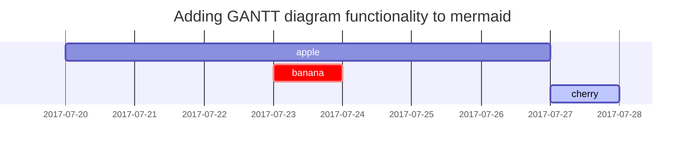

- `https://github.com/cotes2020/jekyll-theme-chirpy/blob/master/_posts/2019-08-08-text-and-typography.md?plain=1`

This post is to show Markdown syntax rendering on
[**Chirpy**](https://github.com/cotes2020/jekyll-theme-chirpy/fork), you can
also use it as an example of writing. Now, let's start looking at text and
typography.

## Titles

---

# H1 - heading

<h2 data-toc-skip>H2 - heading</h2>

<h3 data-toc-skip>H3 - heading</h3>

## <h4>H4 - heading</h4>

## Paragraph

Quisque egestas convallis ipsum, ut sollicitudin risus tincidunt a. Maecenas
interdum malesuada egestas. Duis consectetur porta risus, sit amet vulputate
urna facilisis ac. Phasellus semper dui non purus ultrices sodales. Aliquam ante
lorem, ornare a feugiat ac, finibus nec mauris. Vivamus ut tristique nisi. Sed
vel leo vulputate, efficitur risus non, posuere mi. Nullam tincidunt bibendum
rutrum. Proin commodo ornare sapien. Vivamus interdum diam sed sapien blandit,
sit amet aliquam risus mattis. Nullam arcu turpis, mollis quis laoreet at,
placerat id nibh. Suspendisse venenatis eros eros.

## Lists

### Ordered list

1. Firstly
2. Secondly
3. Thirdly

### Unordered list

- Chapter
  - Section
    - Paragraph

### ToDo list

- [x] Job
  - [x] Step 1
  - [x] Step 2
  - [x] Step 3
  - [x] test page

### Description list

Sun : the star around which the earth orbits

Moon : the natural satellite of the earth, visible by reflected light from the
sun

## Block Quote

> This line shows the _block quote_.

## Prompts

> An example showing the `tip` type prompt. {: .prompt-tip }

> An example showing the `info` type prompt. {: .prompt-info }

> An example showing the `warning` type prompt. {: .prompt-warning }

> An example showing the `danger` type prompt. {: .prompt-danger }

## Tables

| Company                      | Contact          | Country |
| :--------------------------- | :--------------- | ------: |
| Alfreds Futterkiste          | Maria Anders     | Germany |
| Island Trading               | Helen Bennett    |      UK |
| Magazzini Alimentari Riuniti | Giovanni Rovelli |   Italy |

## Links

<http://127.0.0.1:4000>

## Footnote

Click the hook will locate the footnote[^footnote], and here is another
footnote[^fn-nth-2].

## Inline code

This is an example of `Inline Code`.

## Filepath

Here is the `/path/to/the/file.extend`{: .filepath}.

## Code blocks

### Common

```
This is a common code snippet, without syntax highlight and line number.
```

### Specific Language

```bash
if [ $? -ne 0 ]; then
  echo "The command was not successful.";
  #do the needful / exit
fi;
```

### Specific filename

```sass
@import
  "colors/light-typography",
  "colors/dark-typography"
```

{: file='\_sass/jekyll-theme-chirpy.scss'}

## Mathematics

The mathematics powered by [**MathJax**](https://www.mathjax.org/):

$$ \sum\_{n=1}^\infty 1/n^2 = \frac{\pi^2}{6} $$

When $a \ne 0$, there are two solutions to $ax^2 + bx + c = 0$ and they are

$$ x = {-b \pm \sqrt{b^2-4ac} \over 2a} $$

## Mermaid SVG



## Images

### Default (with caption)

{: width="972" height="589" } _Full
screen width and center alignment_

### Left aligned

{: width="972" height="589" .w-75
.normal}

### Float to left

{: width="972" height="589" .w-50
.left} Praesent maximus aliquam sapien. Sed vel neque in dolor pulvinar auctor.
Maecenas pharetra, sem sit amet interdum posuere, tellus lacus eleifend magna,
ac lobortis felis ipsum id sapien. Proin ornare rutrum metus, ac convallis diam
volutpat sit amet. Phasellus volutpat, elit sit amet tincidunt mollis, felis mi
scelerisque mauris, ut facilisis leo magna accumsan sapien. In rutrum vehicula
nisl eget tempor. Nullam maximus ullamcorper libero non maximus. Integer
ultricies velit id convallis varius. Praesent eu nisl eu urna finibus ultrices
id nec ex. Mauris ac mattis quam. Fusce aliquam est nec sapien bibendum, vitae
malesuada ligula condimentum.

### Float to right

{: width="972" height="589" .w-50
.right} Praesent maximus aliquam sapien. Sed vel neque in dolor pulvinar auctor.
Maecenas pharetra, sem sit amet interdum posuere, tellus lacus eleifend magna,
ac lobortis felis ipsum id sapien. Proin ornare rutrum metus, ac convallis diam
volutpat sit amet. Phasellus volutpat, elit sit amet tincidunt mollis, felis mi
scelerisque mauris, ut facilisis leo magna accumsan sapien. In rutrum vehicula
nisl eget tempor. Nullam maximus ullamcorper libero non maximus. Integer
ultricies velit id convallis varius. Praesent eu nisl eu urna finibus ultrices
id nec ex. Mauris ac mattis quam. Fusce aliquam est nec sapien bibendum, vitae
malesuada ligula condimentum.

### Dark/Light mode & Shadow

The image below will toggle dark/light mode based on theme preference, notice it
has shadows.

{: .light .w-75 .shadow
.rounded-10 w='1212' h='668' }
{: .dark .w-75 .shadow
.rounded-10 w='1212' h='668' }

## Video



## Reverse Footnote

[^footnote]: The footnote source

[^fn-nth-2]: The 2nd footnote source

## If you like my content, and want to support me

- If you want to share a tip, you can
  [donate here](https://ko-fi.com/linkarzu/goal?g=6){:target="\_blank"}
- I recently was laid off, so if you know about any SRE related roles, please
  let me know

## Discord server

- My discord server is now open to the public, feel free to join and hang out
  with others
- join the
  [discord server in this link](https://discord.gg/NgqMgwwtMH){:target="\_blank"}

[{: width="300" }](https://discord.gg/NgqMgwwtMH){:target="\_blank"}

## Follow me on social media

- [Twitter (or "X")](https://x.com/link_arzu){:target="\_blank"}
- [LinkedIn](https://www.linkedin.com/in/christianarzu){:target="\_blank"}
- [TikTok](https://www.tiktok.com/@linkarzu){:target="\_blank"}
- [Instagram](https://www.instagram.com/link_arzu){:target="\_blank"}
- [GitHub](https://github.com/linkarzu){:target="\_blank"}
- [Threads](https://www.threads.net/@link_arzu){:target="\_blank"}
- [OnlyFans 🍆](https://linkarzu.com/assets/img/imgs/250126-whyugae.avif){:target="\_blank"}
- [YouTube (subscribe MF, subscribe)](https://www.youtube.com/@linkarzu){:target="\_blank"}
- [Ko-Fi](https://ko-fi.com/linkarzu/goal?g=6){:target="\_blank"}

## All links in the video description

- The following links will be in the YouTube video description:
  - Each one of the videos shown
  - A link to this blogpost

## How do you manage your passwords?

- I've tried many different password managers in the past, I've switched from
  `LastPass` to `Dashlane` and finally ended up in `1password`
- You want to find out why? More info in my article:
  - [How I use 1password to keep all my accounts safe](https://linkarzu.com/posts/1password/1password/){:target="\_blank"}
- **If you want to support me in keeping this blogpost ad free, start your
  1password 14 day free trial by clicking the image below**

[{: width="300" }](https://www.dpbolvw.net/click-101327218-15917064){:target="\_blank"}
